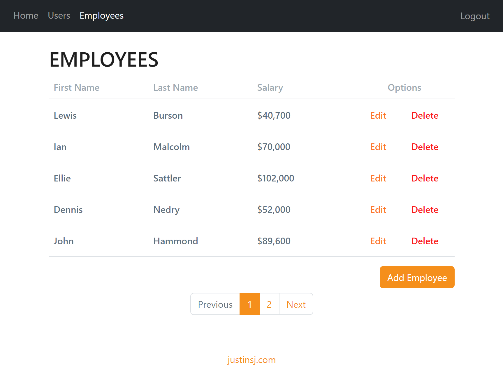

# Payroll App



This app implements the following features:

<li style="list-style-type: '✔️'"> Visualize Employee Table
<ul>
  <li style="list-style-type: '✔️'"> Create employee
  <li style="list-style-type: '✔️'"> Edit employee (Read & Update)
  <li style="list-style-type: '✔️'"> Delete employee
  <li style="list-style-type: '✔️'"> List employees
  <li style="list-style-type: ''"> ✨BONUS✨: Paginate employees
  <li style="list-style-type: ''"> ✨BONUS✨: Paginate employees

</ul>

<li style="list-style-type: '✔️'"> Integrate with a back-end API (using Next.js) and MySQL database
<ul>
  <li style="list-style-type: ''"> ✨BONUS✨: Uses docker-compose to set up & start the database
  <li style="list-style-type: ''">✨BONUS✨: Credentials can be set up using externalized .env / .secret files
</ul>

<li style="list-style-type: '✔️'"> Initialize the database with data from a JSON file
<li style="list-style-type: ''"> ✨BONUS✨: Responsive (mobile-friendly) UI


## Installation
1. Make sure Docker is installed (for the MySQL database).
2. Install the dependencies for the Payroll App.
```
npm install
```

## Usage
1. Start the MySQL database
```
docker-compose -f database\docker-compose.yaml up
```

2. Initialize the data in the database
```
npm run init-db
```

3. Start the Payroll App, which includes API endpoints.
```
npm run dev
```

## Production 
1. Update the db root password in the `.env` file
2. Update the db root password in the `database/db_root_password.secret` file
3. Build the server (this may take a few minutes)
```
npm run build
```
4. Start the server
```
npm run start
```